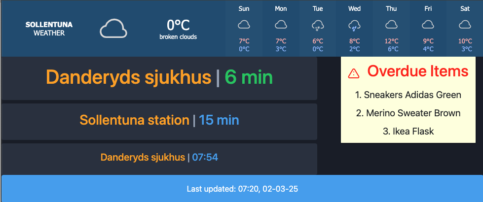

# Smart Mirror

**Fighting laziness one line at a time**, this project aims to build an arsenal of functionalities for a smart mirror in order to effectively design modern life.

The tool is aimed  at providing the following features
* **Public transportation** information (for stockholm as of now)
* **Weather Updates**
* **Inventory Alerts!**


- The prototype for smart mirror is currently tested on Raspberry Pi 4 and Touch display.





# Quick Start

- Clone this repo using 
    - `git clone https://github.com/sridharsabarish/smartMirror.git`
- Clone the Inventory Manager
    - `git clone https://github.com/sridharsabarish/easyInventory.git`
- Start the inventory app
    - `python3 -m app.py`
- Start the Smart mirror app
    - `python3 simpleAPIClient.py`
- Open the link
    - `http://0.0.0.0:2000/`


# Testing

- Run Test Cases using `python3 -m pytest` 


# Weather API
- Note an API key might be needed if you decide to play around with the weather API instead of the weather widget. 
- Please follow the instructions from OpenWeatherAPI to generate API key.
- Once Generated this can be stored in a `.env` file, using ```API_KEY="Your generated API Key"```


# Future Work

<!--- Collapsible section test
> <-->

<details>
<summary> Expand for more </summary>
# Expansion
1. Test on 24 inch screen acting as a mirror.

# Home Automation
1. ESP32 based humiditity/Temperature/Pressure monitoring.
1. PIR Triggering of lights.
1. Automate humidifer with a finger bot
1. Automate Watering of Plants in home


</details>
